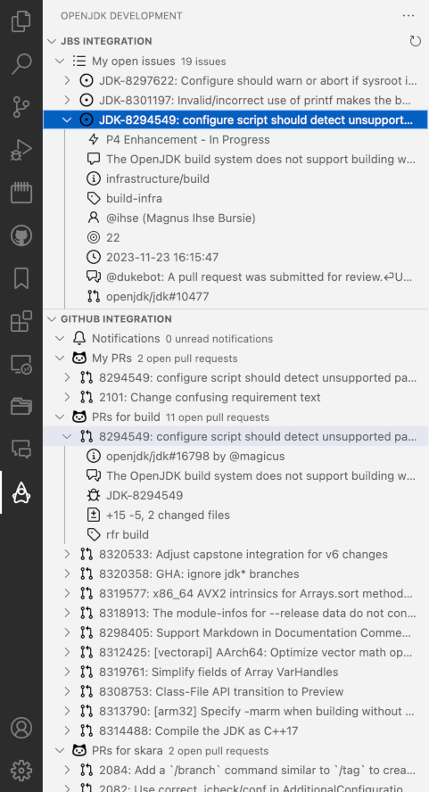

# OpenJDK Development Support Extension

This is a Visual Studio Code extension that provides support OpenJDK
development. The primary audience is active developers in OpenJDK projects.

Currently, the extension provides basic integration with GitHub, but the
intention is to keep adding functionality that is relevant to OpenJDK
developers. If you have any ideas or suggestions, please let me know!

## Extension Settings

This extension contributes the following settings:

* `openjdkDevel.github.username`: GitHub user name needed for GitHub integration
* `openjdkDevel.github.apiToken`: GitHub API token needed for GitHub integration
* `openjdkDevel.locale`: override locale for formatting of e.g. dates

## Extension Commands

This extension contributes the following commands:

* `openjdkDevel.gitHubIntegration.refresh`: Refresh GitHub Integration
* `openjdkDevel.setGithubToken`: Setup GitHub API Token
* `openjdkDevel.setGithubUsername`: Setup GitHub username

## Release Notes

### 1.1.0

Added support for "repo" filters as well as "label" filters.

### 1.0.0

Initial release. This includes basic GitHub integration.
